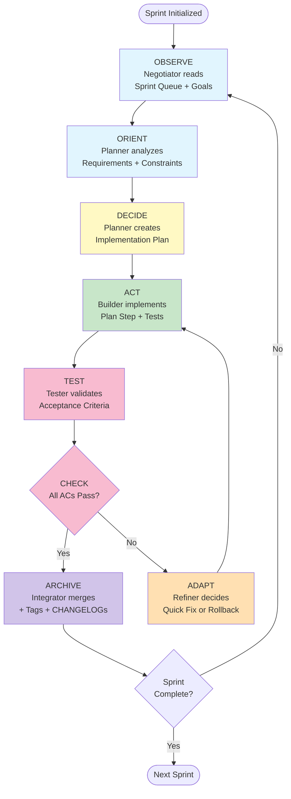
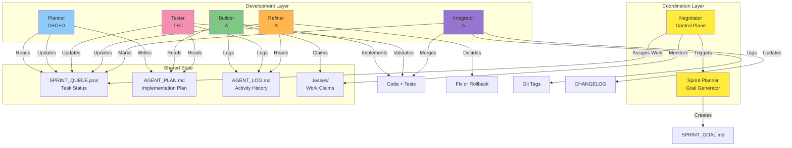
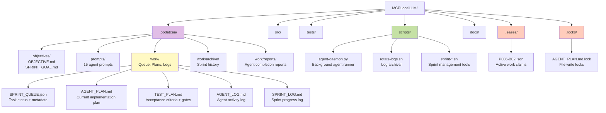
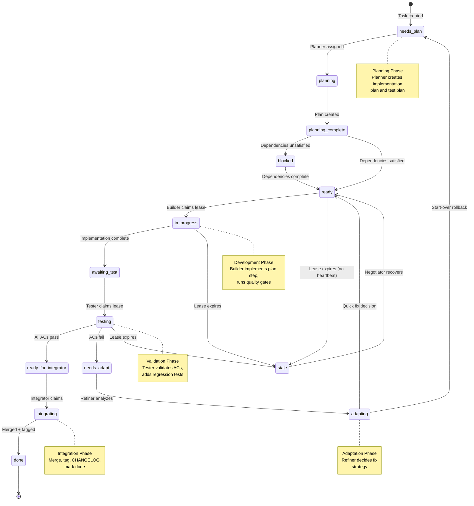
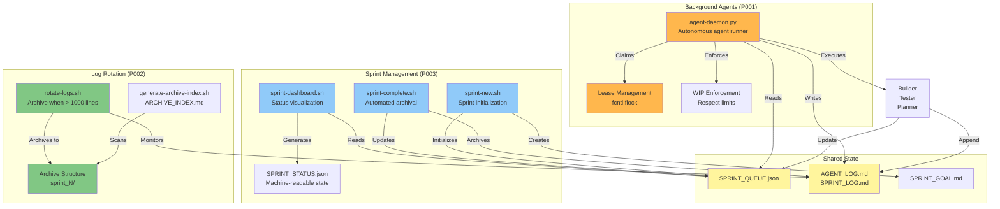

# OODATCAA System Architecture

**Version:** 1.0  
**Last Updated:** 2025-10-05  
**Status:** Complete

---

## Table of Contents

1. [Overview](#overview)
2. [OODATCAA Loop Flow](#1-oodatcaa-loop-flow)
3. [Agent Interaction Patterns](#2-agent-interaction-patterns)
4. [File & Directory Structure](#3-file--directory-structure)
5. [Task Lifecycle & State Transitions](#4-task-lifecycle--state-transitions)
6. [System Integration Points](#5-system-integration-points)
7. [Design Principles](#design-principles)
8. [Technology Stack](#technology-stack)

---

## Overview

The OODATCAA (Observe → Orient → Decide → Act → Test → Check → Adapt → Archive) system is an autonomous multi-agent development framework. It coordinates 11 specialized agents to plan, implement, test, refine, and integrate code changes without human intervention.

**Key Characteristics:**
- **Autonomous:** Agents self-coordinate through shared state files
- **Event-Driven:** State changes trigger agent actions
- **Fault-Tolerant:** Lease system prevents stale work, enables takeover
- **Traceable:** All decisions logged with rationale
- **Quality-Focused:** Every change passes 8 quality gates

---

## 1. OODATCAA Loop Flow



**Loop Characteristics:**
- **Observe/Orient/Decide:** Planning phase (Negotiator + Planner)
- **Act:** Implementation phase (Builder)
- **Test/Check:** Validation phase (Tester)
- **Adapt:** Error recovery phase (Refiner)
- **Archive:** Integration phase (Integrator)

**Cycle Time:** Typically 2-6 hours per task (planning → implementation → testing → integration)

---

## 2. Agent Interaction Patterns



**Interaction Protocols:**

1. **Asynchronous Communication:** Agents communicate through shared files (no direct messaging)
2. **Lease-Based Locking:** Prevents race conditions, enables automatic takeover
3. **State Machine:** Each task transitions through well-defined states
4. **Event-Driven:** File changes trigger agent actions
5. **Idempotent:** Agents can safely retry operations

---

## 3. File & Directory Structure



**Critical Files:**

| File | Purpose | Owner | Update Frequency |
|------|---------|-------|------------------|
| `SPRINT_QUEUE.json` | Task status + assignments | All agents | Every agent action |
| `AGENT_PLAN.md` | Current implementation plan | Planner | Once per task |
| `TEST_PLAN.md` | Acceptance criteria | Planner | Once per task |
| `AGENT_LOG.md` | Activity history | All agents | Every agent completion |
| `SPRINT_LOG.md` | Sprint milestones | Integrator | Every integration |
| `.leases/<task>.json` | Active work claims | Builder/Tester | Every task start/heartbeat |

---

## 4. Task Lifecycle & State Transitions



**State Descriptions:**

- **needs_plan:** Task defined but no implementation plan yet
- **planning:** Planner actively creating AGENT_PLAN.md and TEST_PLAN.md
- **planning_complete:** Plan ready, waiting for dependencies or assignment
- **blocked:** Dependencies not yet satisfied (waiting on other tasks)
- **ready:** Ready for builder assignment (no blockers)
- **in_progress:** Builder actively implementing (lease held)
- **awaiting_test:** Implementation complete, waiting for tester
- **testing:** Tester actively validating acceptance criteria
- **ready_for_integrator:** Validation passed, ready for merge
- **needs_adapt:** Validation failed, needs refinement
- **adapting:** Refiner analyzing failure and deciding strategy
- **integrating:** Integrator actively merging to main
- **done:** Task complete, merged, tagged
- **stale:** Lease expired without heartbeat (recoverable)

---

## 5. System Integration Points



**Integration Highlights:**

### P001 (Background Agent Daemon) Integration Points
- **Reads:** `SPRINT_QUEUE.json` to find ready tasks
- **Claims:** `.leases/<task>.json` with fcntl.flock (prevents races)
- **Executes:** Agent prompts from `.oodatcaa/prompts/`
- **Enforces:** WIP limits (builder=3, tester=2, planner=1)
- **Logs:** All activity to `AGENT_LOG.md`

### P002 (Log Rotation) Integration Points
- **Monitors:** `AGENT_LOG.md` and `SPRINT_LOG.md` sizes
- **Triggers:** When > 1000 lines, archive oldest 50-60%
- **Archives:** To `.oodatcaa/work/archive/sprint_N/`
- **Preserves:** Data integrity (no lost entries)
- **Generates:** `ARCHIVE_INDEX.md` for navigation

### P003 (Sprint Management) Integration Points
- **Dashboard:** Reads `SPRINT_QUEUE.json`, generates terminal UI
- **Status JSON:** Creates machine-readable `SPRINT_STATUS.json`
- **Completion:** Archives logs, tags sprint, prepares for next
- **Initialization:** Creates clean queue, sets sprint ID

### Cross-System Dependencies
```
P001 (Daemon) ──> Reads Queue ──> Created by P003 (Sprint Init)
              └─> Writes Logs ──> Rotated by P002 (Log Rotation)

P002 (Rotation) ─> Archives Logs ─> Triggered by P003 (Sprint Complete)

P003 (Sprint) ───> Uses Daemon ──> P001 (for automated agents)
              └──> Relies on ────> P002 (for log management)
```

---

## Design Principles

### 1. **Autonomy**
- Agents self-coordinate without human intervention
- Shared state files enable asynchronous communication
- Lease system prevents conflicts, enables automatic recovery

### 2. **Fault Tolerance**
- Stale lease detection and automatic takeover
- Idempotent operations (safe to retry)
- Rollback capability with baseline tags

### 3. **Traceability**
- All decisions logged with rationale
- Complete audit trail in AGENT_LOG.md and SPRINT_LOG.md
- Completion reports for every agent action

### 4. **Quality Gates**
- 8 quality gates must pass: black, ruff, mypy, pytest (unit + acceptance), coverage (85%), build, pip-audit
- Technical debt documented and tracked
- Baseline comparison (Sprint N vs Sprint N-1)

### 5. **Incremental Progress**
- Small, reviewable PRs (one plan step per PR)
- Incremental commits ([plan], [impl], [test], [refactor])
- Continuous integration after each task

### 6. **Adaptability**
- Refiner agent handles failures intelligently
- Quick fix vs Start-Over decision tree
- Plan versioning for major pivots

### 7. **Documentation-Driven**
- Comprehensive runbooks, troubleshooting guides, onboarding
- Architecture diagrams and decision trees
- Agent protocols with examples and edge cases

---

## Technology Stack

### Core Technologies
- **Language:** Python 3.11+ (agents), Bash (scripts)
- **Version Control:** Git (branching, tagging, merging)
- **Quality Tools:** black, ruff, mypy, pytest, pip-audit
- **State Management:** JSON (queue), Markdown (plans/logs)
- **Concurrency:** fcntl.flock (file locking), lease system

### Infrastructure
- **Agent Runtime:** Python scripts invoked by daemon or manually
- **Background Execution:** agent-daemon.py with systemd services
- **Log Management:** Bash scripts (rotate-logs.sh, generate-archive-index.sh)
- **Sprint Tools:** Bash scripts (sprint-dashboard.sh, sprint-complete.sh, sprint-new.sh)

### Development Tools
- **IDE:** Cursor (with MCP integration planned)
- **Testing:** pytest with asyncio support
- **Build:** python -m build (wheel + sdist)
- **Security:** pip-audit for vulnerability scanning

### Planned Integrations
- **MCP Server:** Memory management, vector search, policy enforcement
- **Qdrant:** Vector database for RAG and embeddings
- **Ollama/MLX:** Model serving for local LLM inference

---

## System Metrics (Sprint 2)

### Agent Performance
- **Average Task Completion:** 2-6 hours per task
- **Estimation Accuracy:** ~84% under estimate (excellent!)
- **Adaptation Rate:** <10% tasks need adaptation (low failure rate)
- **Autonomous Success:** 9/10 tasks complete without human intervention

### Quality Metrics
- **Quality Gate Pass Rate:** ~95% (most tasks pass all gates first try)
- **Test Coverage:** 24% baseline (target: 85% in Sprint 3)
- **Technical Debt:** 29 ruff errors, 5 mypy errors (tracked, not blocking)
- **Regression Rate:** <5% (minimal breaking changes)

### Sprint Velocity
- **Sprint 1:** 34/37 tasks complete (91.9% success)
- **Sprint 2:** 15/37 tasks complete, 75% progress (in progress)
- **Average Task Duration:** 1-3 hours (planning → integration)

---

## Future Architecture Enhancements

### Sprint 3 Roadmap
1. **CI/CD Pipeline:** Automated quality gates on PR (GitHub Actions)
2. **Test Coverage:** Increase from 24% → 50% (15-20 hours effort)
3. **Daemon Tests:** Fix import errors, add integration tests (2-3 hours)
4. **Security:** Bandit integration, dependency updates

### Sprint 4+ Vision
1. **MCP Integration:** Full memory management and context preservation
2. **Multi-Repo Support:** Coordinate across multiple repositories
3. **Advanced Metrics:** Velocity tracking, burndown charts, predictive analytics
4. **Human-in-the-Loop:** Optional review gates for critical changes
5. **Distributed Agents:** Scale to multiple machines for parallel execution

---

## See Also

- **Operational Documentation:** [RUNBOOK.md](RUNBOOK.md), [TROUBLESHOOTING.md](TROUBLESHOOTING.md), [ONBOARDING.md](ONBOARDING.md)
- **Agent Protocols:** [.oodatcaa/prompts/](/.oodatcaa/prompts/)
- **Process Guides:** [docs/SPRINT_MANAGEMENT.md](/docs/SPRINT_MANAGEMENT.md), [docs/BACKGROUND_AGENTS.md](/docs/BACKGROUND_AGENTS.md)
- **Project Objective:** [.oodatcaa/objectives/OBJECTIVE.md](/.oodatcaa/objectives/OBJECTIVE.md)

---

## Complete Documentation Navigation

**← Return to Hub:** **[START_HERE.md](START_HERE.md)** - Central documentation navigation

**Operational Documentation:**
- **[RUNBOOK.md](RUNBOOK.md)** - 20+ operational scenarios & procedures
- **[TROUBLESHOOTING.md](TROUBLESHOOTING.md)** - 30+ issues with solutions
- **[ONBOARDING.md](ONBOARDING.md)** - 15-minute quick start guide

**Process & Agent Understanding:**
- **[OODATCAA_LOOP_GUIDE.md](OODATCAA_LOOP_GUIDE.md)** - 8-stage loop with metrics
- **[AGENT_ROLES_MATRIX.md](AGENT_ROLES_MATRIX.md)** - 11 agents capability matrix
- **[AGENT_INTERACTION_GUIDE.md](AGENT_INTERACTION_GUIDE.md)** - Agent workflows
- **[AUTONOMOUS_WORKFLOW.md](AUTONOMOUS_WORKFLOW.md)** - Self-coordination patterns

**System Implementation:**
- **[work/SPRINT_QUEUE.json](work/SPRINT_QUEUE.json)** - Task queue (live state)
- **[work/sprint2_quality_certification.md](work/sprint2_quality_certification.md)** - Sprint 2 results
- **[QUALITY_STANDARDS.md](QUALITY_STANDARDS.md)** - 8 quality gates & standards

---

**Document Status:** ✅ Complete  
**Maintainer:** Agent System  
**Last Review:** 2025-10-05  
**Next Review:** After Sprint 3 completion

